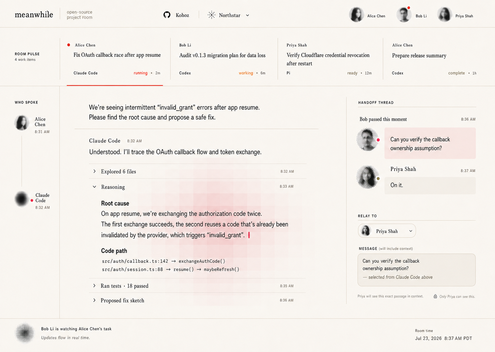

# Shared Project experience brief

This brief supplied the original Definition Gate exploration. ADR 0009 now
selects Connected Onboarding → Project Lobby → Live Deck → Conversation Detail.
The older Project Watch comparison remains below as decision history.

## ADR 0009 selected experience

1. A person signs in with GitHub or Google, or uses the installation's explicit
   local bootstrap path.
2. Onboarding separately authorizes repository discovery and one or more agent
   connections, then lets the person select Projects to surface.
3. The Lobby shows one angular frosted-acrylic card per authorized Project with
   truthful task and presence facts.
4. Entering a Project transitions into Live Deck: one tall acrylic sheet per
   authoritative human-agent conversation.
5. Each sheet keeps the human delegator primary, shows explicit agent and state,
   truncates only its presentation, and opens the complete conversation.
6. Conversation Detail behaves like a coding-agent chat: readable message spine,
   foldable reasoning and tool work, exact transcript selection, and a vertical
   marginalia rail.
7. Annotation remains ambient Project-visible marginalia. Relay remains a named,
   source-anchored handoff with recipient acknowledgement.

Online state comes only from an expiring PresenceLease and is never inferred
from membership. The three people in the Northstar visual are deterministic
fixture leases; production visibility requires active leases from real clients.

## Current acceptance ledger

| Product step | Authoritative implementation | Current proof | Remaining gate |
| --- | --- | --- | --- |
| Sign in | Optional GitHub App / Google OIDC plus installation access; all issue one opaque Meanwhile browser session | Contract, API, BFF, migration, and deterministic browser coverage | Live configured GitHub and Google callback receipts |
| Connected onboarding | Separate ExternalIdentity, repository grant/binding, AgentConnection, and personal Project selection | Mixed GitHub-backed plus local Project browser journey | Provider revocation/relink acceptance on a clean deployment |
| Project Lobby | Provider-neutral `spaces[].tables` read model over authoritative Projects, work, membership, attention, and PresenceLeases | Source-rendered Lobby, empty-room browser proof, and current dirty-tree two-Principal HTTPS system receipt | Two real members entering from separate clients on one clean revision |
| Live Deck | One card per native Run or AgentSession; no second task lifecycle | Source-locked room comparison, browser interaction proof, and deployed BFF visibility for both Principals | Multi-person observation of credentialed live-agent work |
| New task | Contextual self-delegation through the public Project Run contract | Accepted Run enters the room; deterministic journey plus clean local public-repository Demo ACP integration | Real private checkout plus credentialed live-agent receipt |
| Conversation Detail | Native task events, foldable work, transcript index, exact selection, Marginalia, and Relay | Source-locked comparison, Annotation/Relay journey, reload-free local SSE answer receipt, and reciprocal deployed conversation/Annotation/Relay proof | Two-human author/recipient acceptance |

The current development evidence deliberately remains three separate receipts:
the local collaboration system, the two-Principal separate-HTTPS-origin system,
and deterministic ACP compatibility on real Cloudflare remote compute. All
three pass against the current dirty revision. Together they prove the local
authority model, browser topology, and remote runtime boundary; they do not
become a clean release receipt, a credentialed live-agent receipt, or a
two-person attestation by aggregation.

The deterministic journey currently contains 34 explicit checks. Every Live Deck card must
resolve its own authoritative event history; production components contain no fixed task IDs or
fixture-only transcript projections. Created-task
proof is required to show a `running` Run, event times strictly after task
acceptance, and transcript content owned by that task; reusing another fixture's
conversation is a failing product state even when the UI renders cleanly.
Concurrent Live Deck and Conversation Detail history readers must coalesce onto one authoritative
request. Detail establishes SSE from that shared result's cursor, so a card hydration race cannot
leave the terminal state visible while omitting Agent output.

## Product brief

### Primary user

A Project member who did not personally initiate every agent task: a tech lead,
engineer, PM, reviewer, founder, or responsible stakeholder. They may be in a
different location from the delegator and open Meanwhile with little context.

### Trigger

The member opens a shared Project while several people have work running or
recently completed through Claude Code, Codex, an IDE, the SDK, or the CLI.

### Job

In three seconds, understand:

1. whether anything genuinely needs this viewer;
2. what work the Project is currently carrying;
3. who delegated each item and how it is progressing;
4. where to open the task detail and conversation.

### Product promise

> Everyone sees the same execution truth; each person sees only the attention
> and control that actually belong to them.

### Non-goals

- a Kanban or manually managed task lifecycle;
- an agent launcher as the primary product action;
- collaborative cursors, reactions, generic comments, or notifications;
- workflow configuration, assignment, or sprint planning;
- lifecycle control over another member's agent;
- operational metrics or an observability dashboard.

## Experience invariants

### Project truth and personal attention are different

The Project inventory is shared and stable. `Your attention` is a
viewer-specific projection over that truth. A task may need Alice, inform Bob,
and remain visible to Priya without presenting the same alarm to all three.

### Healthy work remains visible

The default shared Project surface must show everyone’s current work even when
nothing needs attention. Healthy tasks may be visually quiet, but must not be
hidden behind a collapsed count; seeing what teammates delegated is the product
proof.

### Attribution is primary information

Every row shows the human delegator in the first reading pass. Agent identity
is secondary. API-key IDs, internal identity nouns, and owner IDs never appear
as people.

### Detail reflects the actual execution

Opening a work item reveals the immutable ask, delegator, authoritative state,
ordered conversation, outputs, workspace/revision basis, and relevant recovery
facts. It does not manufacture a second summary or task status, and the UI does
not introduce `evidence` as a separate product object or user-facing mode.

### Observation does not imply operation

Another member’s item has no cancel, send, interrupt, close, retry, deploy, or
secret-bearing action. This is enforced by the control plane even when the raw
API is called directly.

## Alice and Bob storyboard

### Scene 1 — shared Project entry

Bob opens Project Northstar from another location. The first screen establishes
the Project and Bob’s identity, then answers `Your attention` and shows the full
Project work inventory without requiring a filter or tab change.

### Scene 2 — Alice delegates elsewhere

Alice delegates “Fix OAuth callback race after app resume” from an upstream
client. She explicitly chooses Project Northstar. Meanwhile accepts the
Run/Session with immutable Project and delegator attribution.

The Board now also supports one-shot self-delegation from the room, but the
original cross-member visibility proof remains valid when work originates from
another public client.

### Scene 3 — Bob sees the work live

The item appears in Bob’s shared inventory with Alice’s name, Claude Code,
current execution condition, and a trustworthy last-update time. It does not
appear in Bob’s personal attention merely because it is active.

### Scene 4 — Bob opens detail

Bob opens Alice’s item and reads the original ask, ordered agent conversation,
current result, available outputs, workspace/revision, and relevant recovery
state. The surface makes read-only observation clear through structure rather
than a row of disabled controls.

### Scene 5 — attention diverges by viewer

The run fails or requests permission. Alice sees it in `Your attention`; Bob
sees the same Project issue and its detail but is not told it needs *his*
call. If Bob later owns an explicit operator capability, that is a separate
authorization decision rather than an inference from membership.

### Scene 6 — negative proof

Bob attempts the corresponding lifecycle command through the raw API and is
denied without learning hidden resource facts. Carol, who is not a Project
member, cannot list, stream, open, or infer the item.

## Attention semantics for visual exploration

This table is the current product hypothesis. It must later be reconciled with
the selected capability matrix and durable event contracts.

| Execution fact | Project presentation | Personal attention |
| --- | --- | --- |
| Run `queued`, `provisioning`, `running` | Active | None by default |
| Run `succeeded` | Completed | None without an explicit review contract |
| Run `failed` or `timed_out` | Needs attention | Delegator by default |
| Run `cancelled` | Closed | None |
| Session `queued`, `provisioning`, `running` | Active | None by default |
| Session `idle` | Ready | None by itself |
| Pending permission or explicit `awaiting_input` signal | Waiting on a human | Delegator or explicitly authorized operator |
| Session `continuity_lost` or `failed` | Needs attention | Delegator by default |
| Session `closing` or `closed` | Closing or completed | None |
| Runtime cleanup failure | Operational issue | Maintainer/operator, not every Project member |

Important consequences:

- `idle` is not synonymous with `waiting on you`;
- execution status is not rewritten to encode attention;
- the top verdict may say `Nothing needs you` while the Project still contains
  active or troubled work belonging to other members;
- explicit handoff or mention semantics require a future durable contract.

## Shared mock data

All three product-form studies use the same content so visual structure, rather
than different data, drives the comparison. Date anchor: 2026-07-21.

### Project and viewer

- Project: **Northstar**
- Current viewer: **Bob Li**
- Members: Alice Chen, Bob Li, Priya Shah

### Work

1. **Fix OAuth callback race after app resume**
   - delegated by Alice Chen
   - Claude Code · failed · 4 minutes ago
   - needs Alice, visible but not personally assigned to Bob
2. **Audit v0.1.3 migration plan for data loss**
   - delegated by Bob Li
   - Codex · running · updated 1 minute ago
3. **Verify Cloudflare credential revocation after restart**
   - delegated by Priya Shah
   - Pi · ready · updated 7 minutes ago
4. **Prepare release summary**
   - delegated by Alice Chen
   - Codex · completed · 26 minutes ago

## Product-form comparison contract

Each direction must be a focused 1440 × 1024 desktop Project home and show:

- Northstar and Bob’s member context;
- viewer-specific attention distinct from Project condition;
- all four shared work items and their delegators;
- one clear path into task detail and conversation;
- no primary lifecycle controls, comments, Kanban mutation, presence, or vanity
  metrics.

The three forms deliberately vary information hierarchy and interaction model:

1. **Project Watch** — `Your attention` followed by a dense, always-visible
   shared inventory.
2. **Live Activity** — recent Project changes as the primary reading flow, with
   current work retained as a compact anchor.
3. **Mission Board** — stable spatial grouping by human-relevant condition or
   delegator without introducing manual workflow columns.

Selection criteria are three-second comprehension, shared-work visibility,
truthful personal attention, detail discoverability, scale to 20–50 active
items, and resistance to task-manager or agent-console drift.

## Selected product form — Project Watch

The maintainer selected Project Watch on 2026-07-21, then approved its
human-centered signal-field composition on 2026-07-23. The shared inventory is
an always-visible horizontal `Room Pulse`; opening one item keeps the task
selected above a three-part workbench: a quiet speaker rail, the authoritative
live agent transcript, and a source-anchored human handoff margin. Personal
attention appears before shared inventory in the Room Pulse label, while the
Project-wide condition remains a separate room footer fact.

The visual system is a measured 10/8/4-column Swiss grid on pure white, with
near-black ink, bundled Inter and IBM Plex Mono, generated halftone seat marks,
hairline rules, and one grayscale pixel field behind expanded agent work. One
restrained red marks active selection and human action. The field represents an
active point of shared understanding; it never carries status and never
obscures transcript text. Provider identity and human presence are not
fabricated to match concept art: the implementation renders only authorized
provider bindings and unexpired PresenceLeases beside Project, Principal, work,
event, Annotation, and Relay facts.

The selection explicitly rejects `evidence` as a new user-facing product noun.
Meanwhile may expose source-backed logs, events, outputs, and recovery state in
task detail, but the collaboration experience does not add an Evidence mode,
Durable Record, proof workflow, or case-file metaphor.

